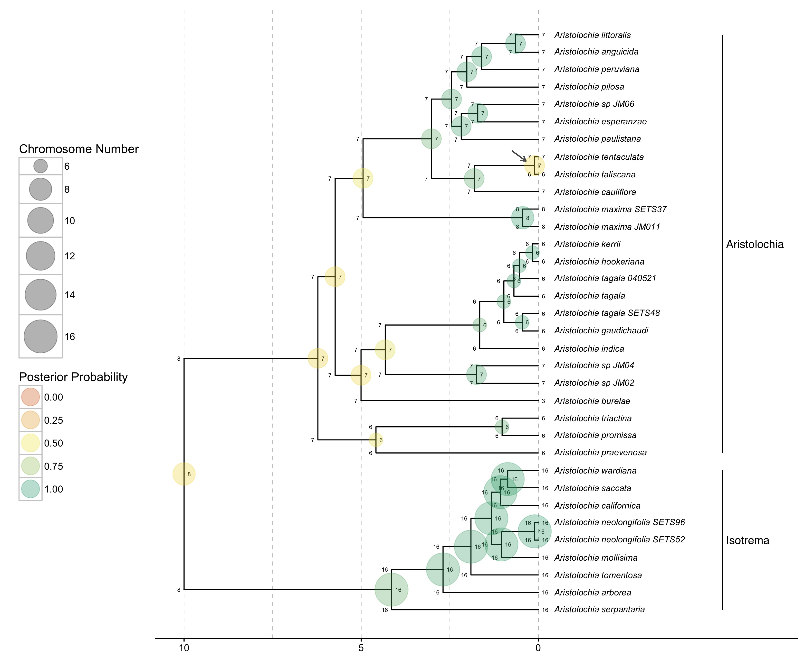

# ChromoSSE: Cladogenetic and Anagenetic Models of Chromosome Number Evolution

This repository contains the scripts used to run the ChromoSSE phylogenetic models of
chromosome number evolution.
These models allow one to infer the mode of chromosome number evolution; 
is chromosome evolution occurring primarily within lineages, 
primarily at lineage splitting, 
or in clade-specific combinations of both? 
Furthermore, they estimate the location and timing of possible chromosome speciation events over the phylogeny
as well as ancestral chromosome numbers.

ChromoSSE was implemented in a Bayesian statistical framework, 
specifically in the software [RevBayes](http://revbayes.com), 
to accommodate uncertainty in parameter estimates while leveraging the full power of likelihood based methods. 
Provided here are the Rev scripts needed to run ChromoSSE in [RevBayes](http://revbayes.com).
Please modify these scripts to use your own data,
and feel free to contact me with any questions.

### Citation:

Freyman, W.A. and S. Höhna. Submitted to *Systematic Biology*. 
Cladogenetic and Anagenetic Models of Chromosome Number Evolution: a Bayesian Model Averaging Approach.
[preprint](http://biorxiv.org/content/early/2016/11/16/086629)

### To run an example ChromoSSE analysis:

```
cd examples/aristolochia/
rb aristolochia_analysis.Rev
```

### To plot the output of a ChromoSSE analysis:

Use the [RevGadegets](https://github.com/revbayes/RevGadgets) R package
and [this example R script](plot_results.R) to generate figures like this:



### Contact:

Will Freyman, UC Berkeley   
freyman@berkeley.edu    
[http://willfreyman.org](http://willfreyman.org)

### Other stuff:

Copyright 2016 Will Freyman     
License: GNU GPLv3 http://www.gnu.org/licenses/gpl.html
